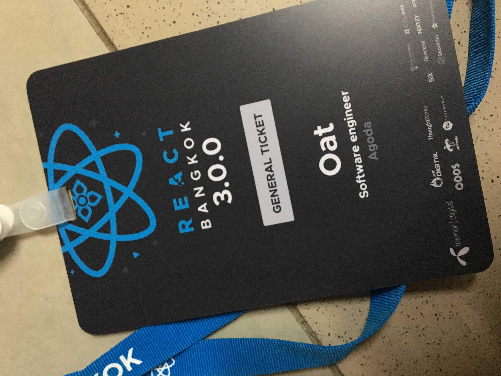

# Hi!

It's been a while I haven't written anything. Accordingly, today might be a good time to start writing something. I will talk about one of the most popular tech meetup event in Thailand, "ReactBkk 3.0".It took place on 24 June 2018. Why do I say the most popular? Because the tickets were sold in **12 seconds !**. However, I'm one of that 12 seconds :grin:. What I will write after this, It might have the only keyword in some topics because I couldn't note all that speakers said and sometimes I lost focus. Anyway, let get started.

## React in 2018 

Start with the summary about React in 2018. They talked about 3 topics below

- Async rendering 
- Deprecated 3 component life cycles 
- Re-architect react native 

## Static web with gastby.js 

This topic they demonstrated how to build the static website with gastby.js. If you love React and love writing a blog. You should try this!

## Static with next.js 

This is like the previous topic but they used next.js instead. If you don't want to learn about GraphQL, you can try this one.

- Prefetch-link-gatsby - make next.js fast like gastby.js

## First time for GraphQL in production 

They said about what should we take into account when we use GraphQL in production. 

- Securing 
  - Limit query depth 
  - Limit amount of returning data 
- Maintenance  
  - Splitting schema 
- Monitoring  
  - Using Apollo engine 
    - Query execute tracing
    - Error tracking
    - Caching
    - Trends 

## Kotlin love react 

Now Kotlin has become popular in a couple of years. If you love Kotlin and love React. Jetbrain guys don't disappoint you. They provide a way to use Kotlin with React. Just a simple command

- create-react-kotlin-app 

## Clojure script with Reactjs 

In addition, Clojure also loves React. You can use Clojure along with React as well. They defined Clojure following theses keywords,

- Simplicity 
- Data-oriented  

They also gave some interesting things for a beginner

- Reagent 
- Re-frame 
 
For Thai people, if you want to use React with Clojure

- เริ่ม Clojure - good keyword in Google 

## State with Mobx 

Mobx, one of the state management library which might be easier to start than redux. I've not tried it but it's interesting, isn't it? 

## Animation in React 

In the world of animation, these keywords might be useful

- Interaction natural  
- Use inappropriate way  
- Communicating animation  

**Principle of Animation**

- Trigger -> Action -> Quality - easing, duration, properties(be careful) 

**Develop animation**

- Native 
  - CSS, might be complexity  
  - Canvas, not easy to make it responsive or accessible  
  - WebGL, like canvas 

- External libraries 
  - Greensock(GSAP)
  - Velocity react 
  - React motion - not good for timeline 
  - React tween 
  - Web animation api 

## Design pattern react 

- HOC - Higher Order Component
  - cons - don’t know where is it come from? 

- Render props 

## Performance tuning 

- Use React performance dev tool 

- Keyword 

  -  Memonize - lamda.js 
  -  React-virtualize 
  -  React fiber,  
 
## Testing 

They seperated test in 3 procedures. Unitest -> Intregation -> E2E

- Avoid implementing detail 

Some useful libraries

- Enzyme 
- React-test-library 
- Cypress  

**Facebook group**

- Next js Thailand
- GraphQL Thailand 

  
<b>See ya!</b>

  

